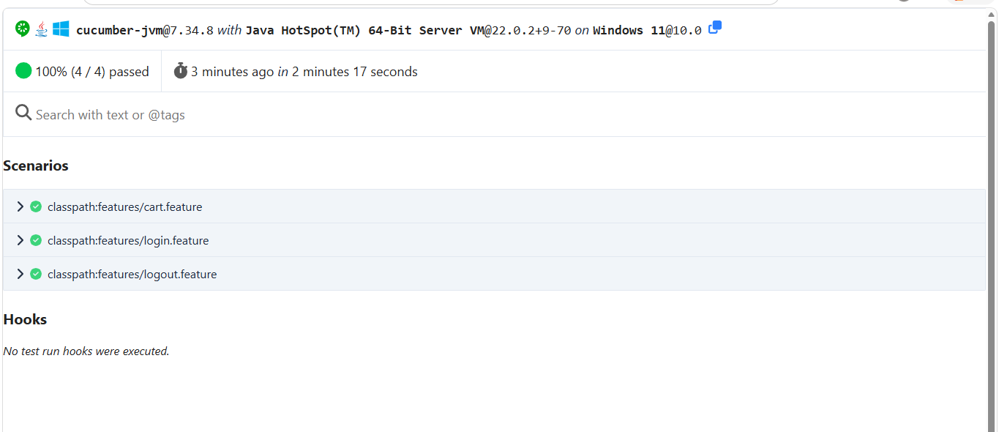
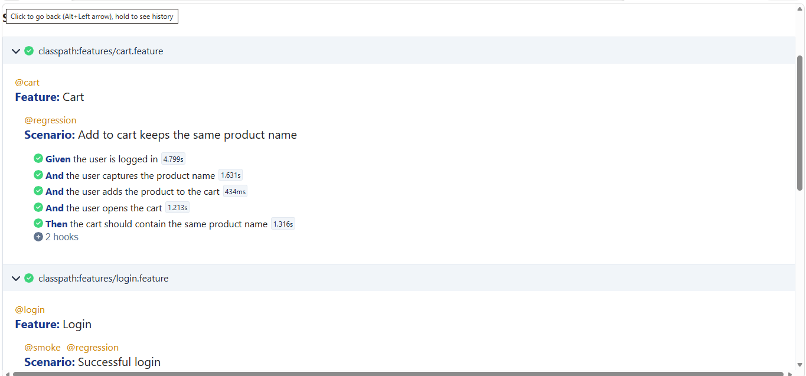
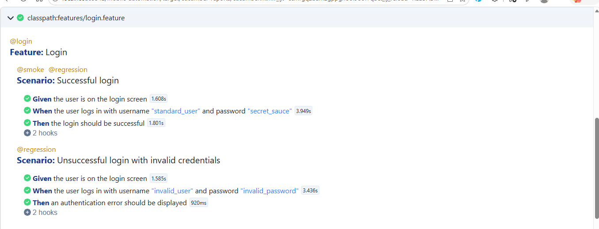

## Prerequisites and Setup
- Java 22 and Maven installed.
- Appium server available (default URL in code: `http://127.0.0.1:4723`).
- Android: emulator/device available and visible to Appium.
- iOS: local execution requires macOS/Xcode with XCUITest, or use a supported mobile cloud provider.
- Project config is read from `src/main/resources/config.properties` by default.

## How to Run Mobile Tests on Android
- Set the app path at runtime (`APP_PATH`) because `config.properties` keeps a placeholder value.
- Use the Cucumber JUnit suite class `RunCucumberTest`.

```powershell
$env:APP_PATH="C:\path\to\app.apk"
mvn test -Dtest=RunCucumberTest
mvn test -Dtest=RunCucumberTest "-Dcucumber.features=src/test/resources/features/login.feature"
mvn test -Dtest=RunCucumberTest "-Dcucumber.filter.tags=@smoke"
mvn test -Dtest=RunCucumberTest "-Dcucumber.filter.tags=@regression"
```

## How to Run Mobile Tests on iOS
- Use the committed sample config file: `src/main/resources/config-ios.properties`.
- The file contains sample values only.
- Replace `udid`, `deviceName`, `app`, and `appiumServerUrl` for your target environment.
- Set `APP_PATH` at runtime.
- Local iOS execution requires macOS/Xcode with XCUITest, or a supported cloud device.
- Current iOS locators in page objects are provisional samples and require validation in a real iOS/XCUITest environment.
- iOS execution is configuration-ready, but not claimed as fully validated in this repository.

```powershell
$env:APP_PATH="/path/to/app.app"
mvn test -Dtest=RunCucumberTest -Dconfig.file="src/main/resources/config-ios.properties"
mvn test -Dtest=RunCucumberTest -Dconfig.file="src/main/resources/config-ios.properties" "-Dcucumber.filter.tags=@smoke"
mvn test -Dtest=RunCucumberTest -Dconfig.file="src/main/resources/config-ios.properties" "-Dcucumber.filter.tags=@regression"
```

## How to Run API Tests
- API test class: `src/test/java/com/mobileautomation/api/ApiTest.java`.

```powershell
mvn -Dtest=ApiTest test
```

## Test Coverage
- Successful login
- Invalid-credentials login
- Logout
- Add-to-cart with cart product-name validation
- API test (`GET /posts/1`, status and `id` assertion)

## Failure Screenshots
- Cucumber `Hooks` capture a screenshot and attach it to the scenario report when a mobile scenario fails.

## Configuration Approach
- Default config source: classpath `config.properties`.
- Optional override file: `-Dconfig.file=<path>`.
- Required keys include: `platform`, `deviceName`, `udid`, `app`, `automationName`, `appWaitActivity`.
- `app` resolution priority in `ConfigManager`:
  1. `APP_PATH` environment variable
  2. `app` property in config file

## Framework Structure and Key Decision
- UI automation stack: Appium + Cucumber + JUnit Platform Suite.
- API testing stack: Rest Assured + JUnit.
- POM design: page objects (`BasePage`, `LoginPage`, `ProductsPage`, `CartPage`) hold locator/action logic.
- Driver lifecycle is centralized in `DriverFactory` and Cucumber `Hooks`.
- Cucumber reports are generated via Maven Surefire `cucumber.plugin` configuration.

## AI usage
- AI assistance was used for scaffolding and iterative refactoring of framework code, locators, and test organization.
- Final behavior depends on local/mobile environment setup and runtime configuration values.

## Design Decisions and Assessment Approach
### What I chose to use
- Java as a programming language.
- Appium for cross-platform mobile UI automation.
- Cucumber for BDD and readable business scenarios.
- JUnit Platform for test execution.
- Maven for dependency management and build execution.
- Page Object Model to separate locators and UI interactions from test scenarios.
- REST Assured for API automation.
- Appium inspector for validating mobile locators.

### Why I chose this approach
The framework separates configuration, driver management, reusable UI interactions, page-specific behavior, step
definitions , and test scenarios.

'DriverFactory' centralizes Android/iOS driver creation and life management.
'BasePage' contains reusable interactions and explicit waits, while individual page Objects contain page-specific locators and behavior.

Android uses UiAutomator2 and the framework is structured to support iOS through XCUITest. 
Shared accessibility IDs are preferred where possible, with platform-specific locators used only where required.

### How AI was used
GitHub Copilot was used as a development assistant for scaffolding , refactoring, exploring implementing options, and documentation.

AI-generated code was not acceptable blindly. Changes were reviewed before acceptance, locators were validated
using Appium Inspector, and changes were verified through compilation and targeted test execution.

AI suggestions that introduced unnecessary complexity or incorrect assumptions were modified or rejected.

### Handling failures , limitations , and trade-offs
Explicit waits are used instead of fixed sleeps for dynamic UI synchronization.
Failure screenshots are attached to failed cucumber scenarios to improve debugging.

Configuration is externalized so machine-specific values such as the application path do not need to be committed to source-control.

The Android implementation was executed and validated locally. iOS configuration and provisional locator
support are included, but iOS execution requires a macOS/Xcode environment or a supported cloud device infrastructure,
so the iOS locators must be validated against the actual iOS accessibility hierarchy.

When failures occur , the approach is to identify the root cause using test reports, Appium output, screenshots, locator
inspection, and environment validation rather than masking failures with arbitrary waits or retries.


## Test Reports
- Cucumber HTML report: `target/cucumber-reports/cucumber.html`
- Cucumber JSON report: `target/cucumber-reports/cucumber.json`
- Maven Surefire reports: `target/surefire-reports`

## Sample Test Execution Reports
The framework generates Cucumber HTML and JSON reports after test execution.
Sample Execution screenshots are below:




